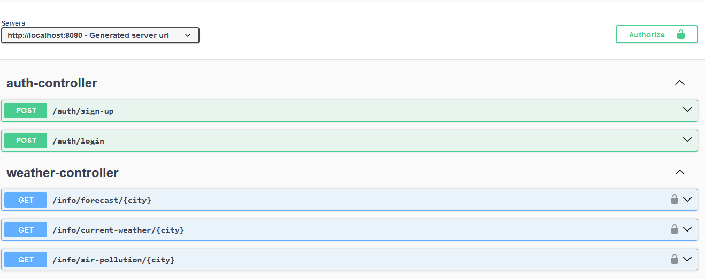
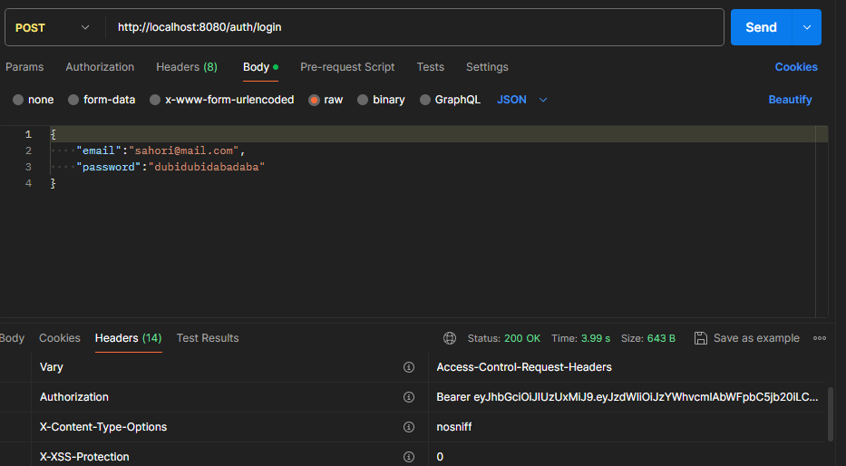
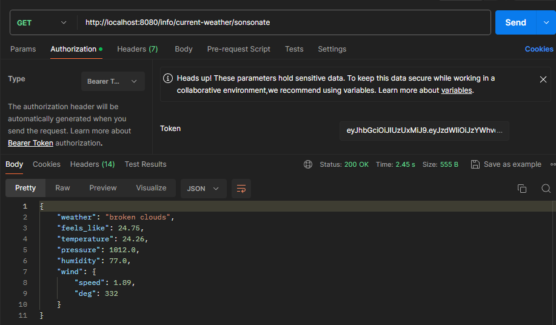

# Weather API
El repositorio contiene el código fuente completo de la aplicación, incluidos los controladores
WeatherController y AuthController, junto con las entidades User, Consultation y modelos tipo DTO
y records para manejar los datos JSON.

# Contenerización
## Docker

Para facilitar la implementación y el despliegue de la aplicación, se ha contenerizado utilizando Docker. El contenedor Docker encapsula la aplicación y todas sus dependencias en un entorno aislado y autocontenido, lo que garantiza la portabilidad y la consistencia del entorno de ejecución.

## Instrucciones de Construcción y Ejecución del Contenedor

Para construir y ejecutar el contenedor Docker, sigue estos pasos:

Asegúrate de tener Docker instalado en tu sistema.
Navega hasta el directorio raíz del proyecto en tu terminal.
Ejecuta los siguientes comandos:

### Construir la imagen del contenedor
    docker-compose build
    docker-compose up -d

Esto construirá la imagen del contenedor Docker utilizando el Dockerfile proporcionado en el proyecto y
luego ejecutará el contenedor en tu máquina local en el puerto 8080.

## Documentacion con Swagger
Se ha facilitado una interfaz gráfica al usuario para que pueda checar el funcionamiento de los distintos
endpoints.

## Ejemplos de consultas usando Postman
- http://localhost:8080/auth/login

- http://localhost:8080/info/current-weather/sonsonate

## Recomendacioens
- Configurar las credenciales de acceso a la API de OpenWeatherMap.
- Configurar la base de datos.
- Añadir un usuario en la base de datos, este será el que permitirá realizar la autorización a las consultas.